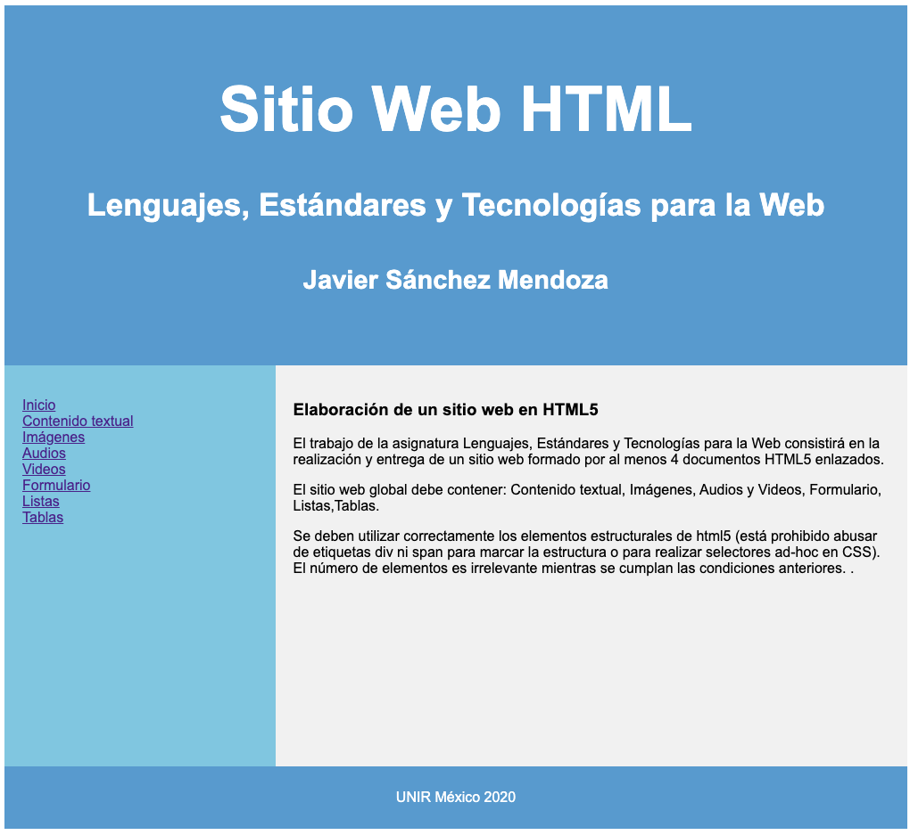

# UNIR html

## Bienvenido! 👋

El trabajo de la Maestria de la asignatura Lenguajes, Estándares y Tecnologías para la Web consistirá en la realización y entrega de un sitio web formado por al menos 4 documentos HTML5 enlazados.

El sitio web global debe contener: Contenido textual, Imágenes, Audios y Videos, Formulario, Listas,Tablas.

Se deben utilizar correctamente los elementos estructurales de html5 (está prohibido abusar de etiquetas div ni span para marcar la estructura o para realizar selectores ad-hoc en CSS). El número de elementos es irrelevante mientras se cumplan las condiciones anteriores. .